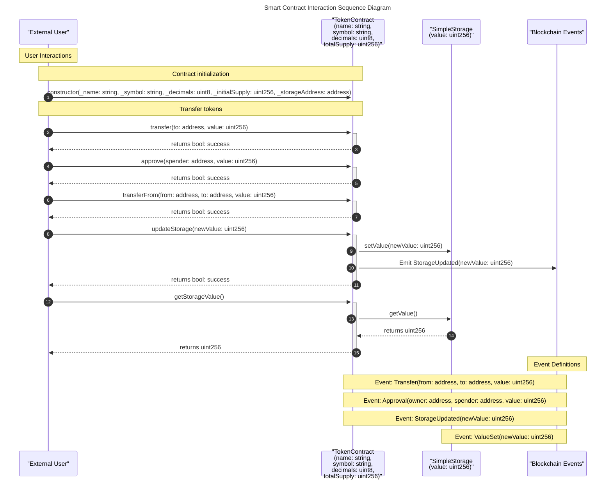

# sol2seq

[](https://crates.io/crates/sol2seq)
[](https://docs.rs/sol2seq)
[](./LICENSE)

A Rust library and CLI tool for generating sequence diagrams from Solidity smart contracts.

## Features

- Generate Mermaid sequence diagrams from Solidity AST JSON files
- Process Solidity source files directly
- Supports both solc-generated and Aderyn-generated AST formats
- Visualize contract interactions, function calls, and events
- Customize diagram appearance with light/dark themes
- Use as a library in your Rust projects or as a CLI tool

## Installation

### From crates.io

```bash
cargo install sol2seq
```

### From source

```bash
git clone https://github.com/cyfrin/sol2seq.git
cd sol2seq
cargo install --path .
```

## Quick Start

### CLI Usage

```bash
# Generate a sequence diagram from an AST JSON file
sol2seq ast path/to/ast.json diagram.md

# Generate with lighter colors
sol2seq --light-colors ast path/to/ast.json diagram.md

# Process Solidity source files directly
sol2seq source Contract.sol Library.sol diagram.md

# Process a directory of Solidity files (recursively finds all .sol files)
sol2seq source ./contracts diagram.md

# Process multiple files and directories
sol2seq source Contract.sol ./contracts ./lib/interfaces diagram.md
```

### Library Usage

```rust
use anyhow::Result;
use sol2seq::{generate_diagram_from_file, Config};

fn main() -> Result<()> {
    // Create a configuration
    let config = Config {
        light_colors: false,
        output_file: Some("diagram.md".into()),
    };

    // Generate diagram from AST file
    let diagram = generate_diagram_from_file("path/to/ast.json", config)?;
    
    println!("Diagram generated successfully!");
    Ok(())
}
```

## Documentation

For complete documentation, please visit [docs.rs/sol2seq](https://docs.rs/sol2seq).

## Example Output

The generated sequence diagrams use Mermaid syntax and can be viewed in markdown editors that support Mermaid (like GitHub, VS Code with the Mermaid extension, etc.). Here's an example of what the output looks like:



The diagram clearly shows:
- Contract participants with their state variables
- User interactions with contracts
- Contract-to-contract interactions
- Event emissions
- Return values
- Categorized sections with notes

## Integration with Aderyn

This tool integrates with [Aderyn](https://github.com/cyfrin/aderyn), a Solidity static analyzer by Cyfrin:

```bash
# Generate AST with Aderyn
aderyn ./contracts --ast-json

# Generate sequence diagram
sol2seq ast ./reports/combined_ast.json ./reports/sequence_diagram.md --light-colors
```

## License

This project is licensed under the MIT License - see the [LICENSE](LICENSE) file for details.

## Contributing

Contributions are welcome! Please feel free to submit a Pull Request. 