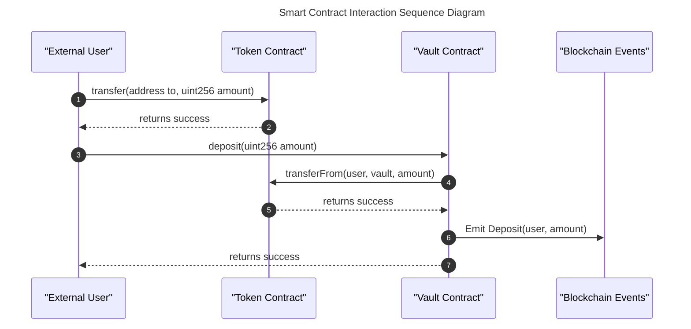

# sol2seq

[](https://crates.io/crates/sol2seq)
[](https://docs.rs/sol2seq)
[](./LICENSE)

A Rust library and CLI tool for generating sequence diagrams from Solidity smart contracts.

## Features

- Generate Mermaid sequence diagrams from Solidity AST JSON files
- Process Solidity source files directly
- Visualize contract interactions, function calls, and events
- Customize diagram appearance with light/dark themes
- Use as a library in your Rust projects or as a CLI tool

## Installation

### From crates.io

```bash
cargo install sol2seq
```

### From source

```bash
git clone https://github.com/cyfrin/sol2seq.git
cd sol2seq
cargo install --path .
```

## Quick Start

### CLI Usage

```bash
# Generate a sequence diagram from an AST JSON file
sol2seq path/to/ast.json diagram.md

# Generate with lighter colors
sol2seq --light-colors path/to/ast.json diagram.md

# Process Solidity source files directly
sol2seq --source-files Contract.sol Library.sol diagram.md
```

### Library Usage

```rust
use anyhow::Result;
use sol2seq::{generate_diagram_from_file, Config};

fn main() -> Result<()> {
    // Create a configuration
    let config = Config {
        light_colors: false,
        output_file: Some("diagram.md".into()),
    };

    // Generate diagram from AST file
    let diagram = generate_diagram_from_file("path/to/ast.json", config)?;
    
    println!("Diagram generated successfully!");
    Ok(())
}
```

## Documentation

For complete documentation, please visit [docs.rs/sol2seq](https://docs.rs/sol2seq).

## Example Output

The generated sequence diagrams look like this:



## Integration with Aderyn

This tool integrates with [Aderyn](https://github.com/cyfrin/aderyn), a Solidity static analyzer by Cyfrin:

```bash
# Generate AST with Aderyn
aderyn ./contracts --ast-json

# Generate sequence diagram
sol2seq ./reports/ast.json ./reports/sequence_diagram.md --light-colors
```

## License

This project is licensed under the MIT License - see the [LICENSE](LICENSE) file for details.

## Contributing

Contributions are welcome! Please feel free to submit a Pull Request. 