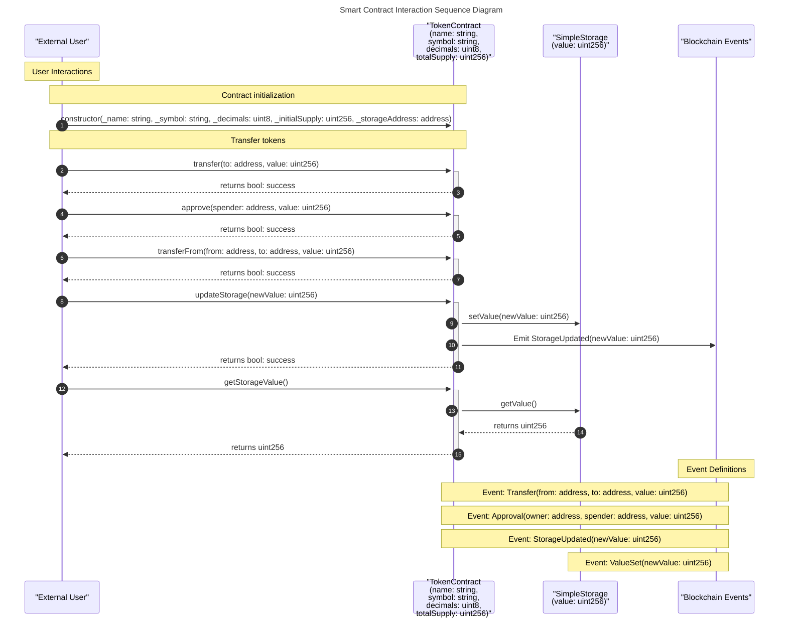

# sol2seq

A Rust library and CLI tool for generating sequence diagrams from Solidity smart contracts.

## Features

- Generate Mermaid sequence diagrams from Solidity AST JSON files
- Process Solidity source files directly
- Supports both solc-generated and Aderyn-generated AST formats
- Visualize contract interactions, function calls, and events
- Customize diagram appearance with light/dark themes
- Use as a library in your Rust projects or as a CLI tool

## Installation

```bash
# As a CLI tool
cargo install sol2seq

# Or from source
git clone https://github.com/sumitvekariya/sol2seq.git
cd sol2seq
cargo install --path .
```

## CLI Usage

```bash
# Generate a sequence diagram from Solidity source files directly
sol2seq source Contract.sol Library.sol output_diagram.md

# Generate a sequence diagram from an AST JSON file
sol2seq ast path/to/ast.json output_diagram.md

# Generate with lighter colors
sol2seq source --light-colors Contract.sol output_diagram.md
sol2seq ast --light-colors path/to/ast.json output_diagram.md
```

### Command-Line Arguments

```
Usage: sol2seq [OPTIONS] <COMMAND>

Commands:
  source  Generate diagram from Solidity source files
  ast     Generate diagram from AST JSON file
  help    Print this message or the help of the given subcommand(s)

Options:
  -l, --light-colors  Use lighter colors for the sequence diagram
  -h, --help          Print help information
  -V, --version       Print version information
```

#### Source Command

```
Usage: sol2seq source [OPTIONS] <SOURCE_FILES>... [OUTPUT_FILE]

Arguments:
  <SOURCE_FILES>...  Solidity source files to process
  [OUTPUT_FILE]      Output file path (optional, will print to stdout if not provided)

Options:
  -l, --light-colors  Use lighter colors for the sequence diagram
  -h, --help          Print help information
```

#### AST Command

```
Usage: sol2seq ast [OPTIONS] <AST_FILE> [OUTPUT_FILE]

Arguments:
  <AST_FILE>       AST JSON file path
  [OUTPUT_FILE]    Output file path (optional, will print to stdout if not provided)

Options:
  -l, --light-colors  Use lighter colors for the sequence diagram
  -h, --help          Print help information
```

### Generating AST JSON

If you prefer to generate the AST JSON manually and then use it with sol2seq, you can use one of the following methods:

#### Using Solidity Compiler

```bash
# Generate AST JSON for a Solidity file
solc --combined-json ast Contract.sol > contract_ast.json

# Then use sol2seq to generate a sequence diagram
sol2seq ast contract_ast.json diagram.md
```

#### Using Aderyn

sol2seq also supports the AST format generated by [Aderyn](https://github.com/cyfrin/aderyn):

```bash
# Generate AST using Aderyn
aderyn /path/to/contracts --ast-json

# Then use sol2seq with the Aderyn-generated AST
sol2seq ast reports/combined_ast.json diagram.md
```

## Library Usage

```rust
use anyhow::Result;
use sol2seq::{generate_diagram_from_file, generate_diagram_from_sources, Config};

fn main() -> Result<()> {
    // Create a configuration
    let config = Config {
        light_colors: false,
        output_file: Some("diagram.md".into()),
    };

    // Generate diagram from AST file
    let diagram = generate_diagram_from_file("path/to/ast.json", config.clone())?;
    println!("AST diagram generated successfully!");
    
    // Generate diagram directly from Solidity source files
    let source_files = vec!["Contract.sol", "Library.sol"];
    let diagram = generate_diagram_from_sources(&source_files, config)?;
    println!("Source files diagram generated successfully!");
    
    Ok(())
}
```

### API Reference

The library provides the following main functions:

#### `generate_diagram_from_file`

Generates a sequence diagram from an AST JSON file.

```rust
pub fn generate_diagram_from_file<P: AsRef<std::path::Path>>(
    ast_file: P,
    config: Config,
) -> Result<String>
```

**Parameters:**
- `ast_file`: Path to the AST JSON file.
- `config`: Configuration for diagram generation.

**Returns:**
- The generated diagram as a string.

#### `generate_diagram_from_sources`

Generates a sequence diagram directly from Solidity source files.

```rust
pub fn generate_diagram_from_sources<P: AsRef<std::path::Path>>(
    source_files: &[P],
    config: Config,
) -> Result<String>
```

**Parameters:**
- `source_files`: Paths to Solidity source files.
- `config`: Configuration for diagram generation.

**Returns:**
- The generated diagram as a string.

## Example Output

The generated sequence diagrams use Mermaid syntax and can be viewed in markdown editors that support Mermaid (like GitHub, VS Code with the Mermaid extension, etc.). Here's an example of what the output looks like:



The diagram clearly shows:
- Contract participants with their state variables
- User interactions with contracts
- Contract-to-contract interactions
- Event emissions
- Return values
- Categorized sections with notes