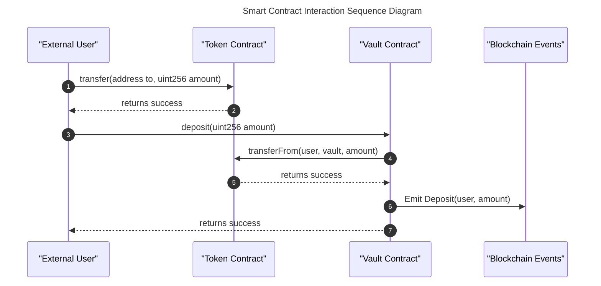

# sol2seq

A Rust library and CLI tool for generating sequence diagrams from Solidity smart contracts.

## Features

- Generate Mermaid sequence diagrams from Solidity AST JSON files
- Process Solidity source files directly
- Visualize contract interactions, function calls, and events
- Customize diagram appearance with light/dark themes
- Use as a library in your Rust projects or as a CLI tool

## Installation

```bash
# As a CLI tool
cargo install sol2seq

# Or from source
git clone https://github.com/sumitvekariya/sol2seq.git
cd sol2seq
cargo install --path .
```

## CLI Usage

```bash
# Generate a sequence diagram from an AST JSON file
sol2seq path/to/ast.json diagram.md

# Generate with lighter colors
sol2seq --light-colors path/to/ast.json diagram.md

# Process Solidity source files directly
sol2seq --source-files Contract.sol Library.sol diagram.md
```

### Command-Line Arguments

```
Usage: sol2seq [OPTIONS] <AST_FILE> [OUTPUT_FILE]

Arguments:
  <AST_FILE>
          AST JSON file path
          Required: The path to the Solidity Abstract Syntax Tree (AST) JSON file

  [OUTPUT_FILE]
          Output file path
          Optional: If not provided, the diagram will be printed to stdout

Options:
  -l, --light-colors
          Use lighter colors for the sequence diagram
          Makes the diagram more readable on light backgrounds

  -s, --source-files <SOURCE_FILES>
          Solidity source files to process directly
          Allows processing .sol files without pre-generating an AST JSON file

  -h, --help
          Print help information

  -V, --version
          Print version information
```

## Library Usage

```rust
use anyhow::Result;
use sol2seq::{generate_diagram_from_file, Config};

fn main() -> Result<()> {
    // Create a configuration
    let config = Config {
        light_colors: false,
        output_file: Some("diagram.md".into()),
    };

    // Generate diagram from AST file
    let diagram = generate_diagram_from_file("path/to/ast.json", config)?;
    
    println!("Diagram generated successfully!");
    Ok(())
}
```

### API Reference

The library provides the following main functions:

#### `generate_diagram_from_file`

Generates a sequence diagram from an AST JSON file.

```rust
pub fn generate_diagram_from_file<P: AsRef<std::path::Path>>(
    ast_file: P,
    config: Config,
) -> Result<String>
```

**Parameters:**
- `ast_file`: Path to the AST JSON file.
- `config`: Configuration for diagram generation.

**Returns:**
- The generated diagram as a string.

#### `generate_diagram_from_sources`

Generates a sequence diagram directly from Solidity source files.

```rust
pub fn generate_diagram_from_sources<P: AsRef<std::path::Path>>(
    source_files: &[P],
    config: Config,
) -> Result<String>
```

**Parameters:**
- `source_files`: Paths to Solidity source files.
- `config`: Configuration for diagram generation.

**Returns:**
- The generated diagram as a string.

#### `generate_sequence_diagram`

Low-level function that generates a sequence diagram from an AST JSON value.

```rust
pub fn generate_sequence_diagram(ast: &Value, light_colors: bool) -> Result<String>
```

**Parameters:**
- `ast`: The AST JSON value.
- `light_colors`: Whether to use lighter colors for the diagram.

**Returns:**
- The generated diagram as a string.

### Configuration

The `Config` struct provides configuration options for diagram generation:

```rust
pub struct Config {
    /// Use lighter colors for the diagram
    pub light_colors: bool,

    /// Output file path (None for stdout)
    pub output_file: Option<PathBuf>,
}
```

**Fields:**
- `light_colors`: Whether to use lighter colors for the diagram.
- `output_file`: Optional path to save the diagram to a file. If `None`, the diagram is returned as a string without writing to a file.

## Diagram Format

The generated sequence diagrams use Mermaid syntax and include:

- User interactions (public/external function calls)
- Contract-to-contract interactions
- Event emissions
- Function return values
- Contract relationships
- Organized sections with color coding

### Diagram Sections

The generated diagram is organized into the following sections:

1. **User Interactions**: Shows how external users interact with the contracts, including function calls and data flows.
   
2. **Contract-to-Contract Interactions**: Displays how contracts interact with each other, grouped by function calls.
   
3. **Event Definitions**: Lists all events emitted by the contracts.
   
4. **Contract Relationships**: Shows the relationships between contracts, including:
   - Available functions in each contract
   - Inheritance relationships
   - Contract types (contract, library, interface)
   - Dependencies and interactions between contracts

### Color Themes

Two color themes are available:

- **Default Theme** (dark colors):
  - Primary Color: #f5f5f5
  - Text Color: #333
  - Border Color: #999
  - Line Color: #666
  - Section Colors: Light blue (#f0f8ff) and light red (#fff5f5)

- **Light Theme** (lighter colors, better for light backgrounds):
  - Primary Color: #fafbfc
  - Text Color: #444
  - Border Color: #e1e4e8
  - Line Color: #a0aec0
  - Section Colors: Light blue (#f5fbff) and light red (#fff8f8)

### Legend

Each diagram includes a legend explaining:
- Different types of interactions (calls, returns, events)
- Color coding for different sections
- Participant roles and responsibilities

## Examples

### Sample Code

**Process an AST JSON file:**

```rust
use anyhow::Result;
use sol2seq::{generate_diagram_from_file, Config};
use std::path::PathBuf;

fn main() -> Result<()> {
    let config = Config {
        light_colors: true,
        output_file: Some(PathBuf::from("contract_diagram.md")),
    };
    
    generate_diagram_from_file("contract_ast.json", config)?;
    println!("Diagram generated at contract_diagram.md");
    
    Ok(())
}
```

**Process Solidity files directly:**

```rust
use anyhow::Result;
use sol2seq::{generate_diagram_from_sources, Config};

fn main() -> Result<()> {
    let source_files = vec!["Token.sol", "Vault.sol", "Governance.sol"];
    
    let config = Config {
        light_colors: false,
        output_file: Some("protocol_diagram.md".into()),
    };
    
    generate_diagram_from_sources(&source_files, config)?;
    println!("Diagram generated at protocol_diagram.md");
    
    Ok(())
}
```

### Sample Output

The generated Mermaid diagram markdown can be rendered by any Mermaid-compatible renderer, such as:
- GitHub markdown (which natively supports Mermaid)
- Mermaid.js Live Editor (https://mermaid.live)
- VS Code with Mermaid extension
- Documentation tools like Docusaurus or MkDocs

Sample diagram structure:


## Use with Aderyn

This tool is designed to work seamlessly with [Aderyn](https://github.com/cyfrin/aderyn), a Solidity static analyzer developed by Cyfrin. Integration enables automated generation of sequence diagrams as part of your smart contract analysis workflow.

### Integration Steps

1. **Install Aderyn**: Follow the installation instructions at the [Aderyn repository](https://github.com/cyfrin/aderyn).

2. **Generate AST with Aderyn**: Run Aderyn on your smart contract project to generate the AST.
   ```bash
   aderyn /path/to/contracts --ast-json
   ```

3. **Use sol2seq with the Generated AST**: After Aderyn generates the AST JSON file, use sol2seq to create sequence diagrams.
   ```bash
   sol2seq reports/ast.json contract_diagram.md
   ```

### Automated Workflow

You can also automate the process by creating a script that:
1. Runs Aderyn to analyze contracts
2. Extracts the AST JSON
3. Generates sequence diagrams with sol2seq
4. Incorporates the diagrams into your documentation

Example script:
```bash
#!/bin/bash
# Run Aderyn to generate AST
aderyn ./contracts --ast-json

# Generate sequence diagram
sol2seq ./reports/ast.json ./reports/sequence_diagram.md --light-colors

echo "Analysis and sequence diagram generation completed"
```

## License

MIT 