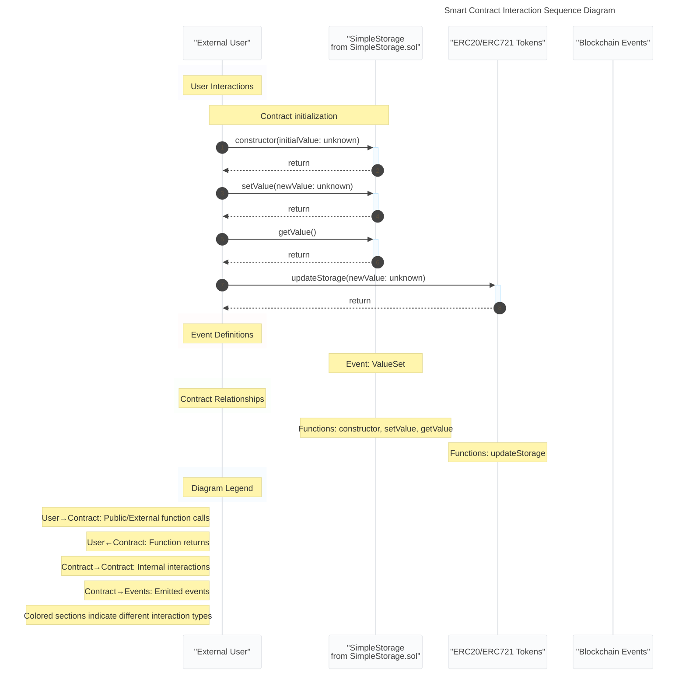

```mermaid
sequenceDiagram
title Smart Contract Interaction Sequence Diagram
autonumber

%%{init: {
  'theme': 'base',
  'themeVariables': {
    'primaryColor': '#fafbfc',
    'primaryTextColor': '#444',
    'primaryBorderColor': '#e1e4e8',
    'lineColor': '#a0aec0',
    'secondaryColor': '#f5fbff',
    'tertiaryColor': '#fff8f8'
  }
}}%%

participant User as "External User"
participant SimpleStorage as "SimpleStorage<br/>from SimpleStorage.sol"
participant TokenContract as "ERC20/ERC721 Tokens"
participant Events as "Blockchain Events"

rect rgb(252, 252, 255)
Note over User: User Interactions
end

Note over User,SimpleStorage: Contract initialization
User->>+SimpleStorage: constructor(initialValue: unknown)
SimpleStorage-->>-User: return
User->>+SimpleStorage: setValue(newValue: unknown)
SimpleStorage-->>-User: return
User->>+SimpleStorage: getValue()
SimpleStorage-->>-User: return
User->>+TokenContract: updateStorage(newValue: unknown)
TokenContract-->>-User: return

rect rgb(255, 252, 252)
Note over User: Event Definitions
end

Note over SimpleStorage,SimpleStorage: Event: ValueSet

rect rgb(252, 255, 252)
Note over User: Contract Relationships
end

Note over SimpleStorage: Functions: constructor, setValue, getValue
Note over TokenContract: Functions: updateStorage


%%{init: { 'sequence': { 'showSequenceNumbers': true } }}%%

rect rgb(248, 252, 255)
Note over User: Diagram Legend
end

Note left of User: User→Contract: Public/External function calls
Note left of User: User←Contract: Function returns
Note left of User: Contract→Contract: Internal interactions
Note left of User: Contract→Events: Emitted events
Note left of User: Colored sections indicate different interaction types
```