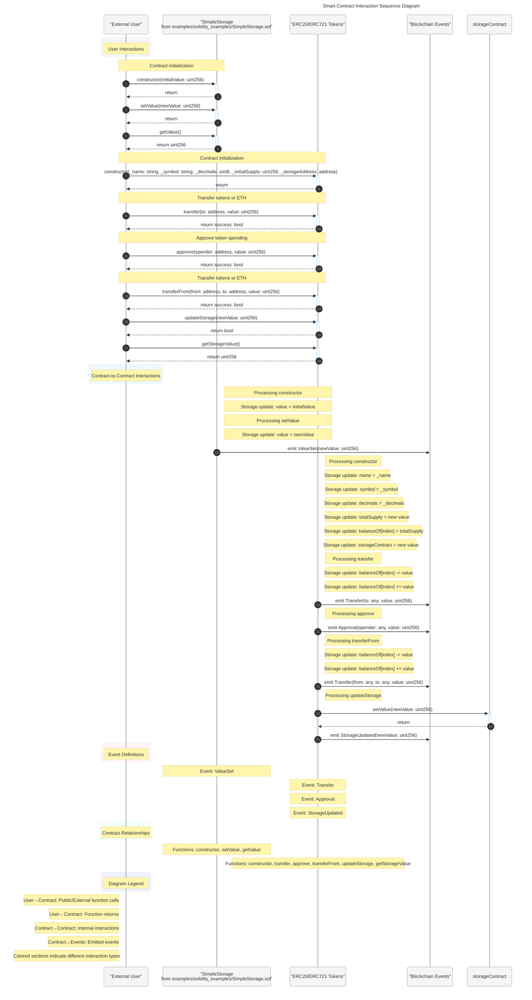

```mermaid
sequenceDiagram
title Smart Contract Interaction Sequence Diagram
autonumber

%%{init: {
  'theme': 'base',
  'themeVariables': {
    'primaryColor': '#f5f5f5',
    'primaryTextColor': '#333',
    'primaryBorderColor': '#999',
    'lineColor': '#666',
    'secondaryColor': '#f0f8ff',
    'tertiaryColor': '#fff5f5'
  }
}}%%

participant User as "External User"
participant SimpleStorage as "SimpleStorage<br/>from examples/solidity_examples/SimpleStorage.sol"
participant TokenContract as "ERC20/ERC721 Tokens"
participant Events as "Blockchain Events"

rect rgb(245, 245, 245)
Note over User: User Interactions
end

Note over User,SimpleStorage: Contract initialization
User->>+SimpleStorage: constructor(initialValue: uint256)
SimpleStorage-->>-User: return
User->>+SimpleStorage: setValue(newValue: uint256)
SimpleStorage-->>-User: return
User->>+SimpleStorage: getValue()
SimpleStorage-->>-User: return uint256
Note over User,TokenContract: Contract initialization
User->>+TokenContract: constructor(_name: string, _symbol: string, _decimals: uint8, _initialSupply: uint256, _storageAddress: address)
TokenContract-->>-User: return
Note over User,TokenContract: Transfer tokens or ETH
User->>+TokenContract: transfer(to: address, value: uint256)
TokenContract-->>-User: return success: bool
Note over User,TokenContract: Approve token spending
User->>+TokenContract: approve(spender: address, value: uint256)
TokenContract-->>-User: return success: bool
Note over User,TokenContract: Transfer tokens or ETH
User->>+TokenContract: transferFrom(from: address, to: address, value: uint256)
TokenContract-->>-User: return success: bool
User->>+TokenContract: updateStorage(newValue: uint256)
TokenContract-->>-User: return bool
User->>+TokenContract: getStorageValue()
TokenContract-->>-User: return uint256

rect rgb(240, 248, 255)
Note over User: Contract-to-Contract Interactions
end

Note right of SimpleStorage: Processing constructor
Note right of SimpleStorage: Storage update: value = initialValue

Note right of SimpleStorage: Processing setValue
Note right of SimpleStorage: Storage update: value = newValue
SimpleStorage->>Events: emit ValueSet(newValue: uint256)

Note right of TokenContract: Processing constructor
Note right of TokenContract: Storage update: name = _name
Note right of TokenContract: Storage update: symbol = _symbol
Note right of TokenContract: Storage update: decimals = _decimals
Note right of TokenContract: Storage update: totalSupply = new value
Note right of TokenContract: Storage update: balanceOf[index] = totalSupply
Note right of TokenContract: Storage update: storageContract = new value

Note right of TokenContract: Processing transfer
Note right of TokenContract: Storage update: balanceOf[index] -= value
Note right of TokenContract: Storage update: balanceOf[index] += value
TokenContract->>Events: emit Transfer(to: any, value: uint256)

Note right of TokenContract: Processing approve
TokenContract->>Events: emit Approval(spender: any, value: uint256)

Note right of TokenContract: Processing transferFrom
Note right of TokenContract: Storage update: balanceOf[index] -= value
Note right of TokenContract: Storage update: balanceOf[index] += value
TokenContract->>Events: emit Transfer(from: any, to: any, value: uint256)

Note right of TokenContract: Processing updateStorage
TokenContract->>+storageContract: setValue(newValue: uint256)
storageContract-->>-TokenContract: return
TokenContract->>Events: emit StorageUpdated(newValue: uint256)


rect rgb(255, 245, 245)
Note over User: Event Definitions
end

Note over SimpleStorage,SimpleStorage: Event: ValueSet
Note over TokenContract,TokenContract: Event: Transfer
Note over TokenContract,TokenContract: Event: Approval
Note over TokenContract,TokenContract: Event: StorageUpdated

rect rgb(245, 255, 245)
Note over User: Contract Relationships
end

Note over SimpleStorage: Functions: constructor, setValue, getValue
Note over TokenContract: Functions: constructor, transfer, approve, transferFrom, updateStorage, getStorageValue


%%{init: { 'sequence': { 'showSequenceNumbers': true } }}%%

rect rgb(240, 240, 255)
Note over User: Diagram Legend
end

Note left of User: User→Contract: Public/External function calls
Note left of User: User←Contract: Function returns
Note left of User: Contract→Contract: Internal interactions
Note left of User: Contract→Events: Emitted events
Note left of User: Colored sections indicate different interaction types
```
